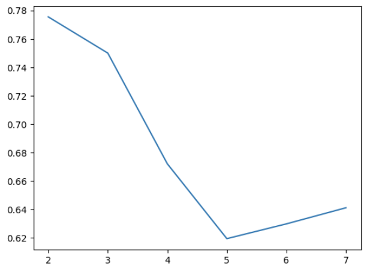
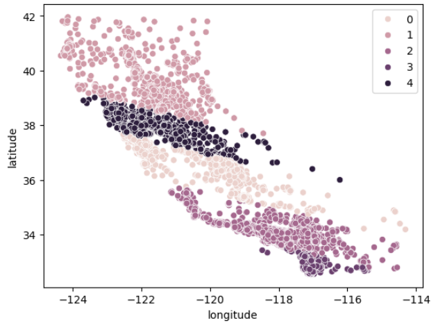
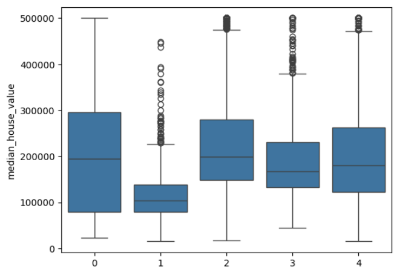

# K-Means-Clustering

Exercício realizado com base no turorial do site https://www.datacamp.com/tutorial/k-means-clustering-python.

Neste projeto, foi realizado um agrupamento (clustering) de regiões da Califórnia usando o algoritmo K-Means, com base em localização geográfica, para entender padrões de preços de imóveis.

## Metodos

Teste para definição da quantidade de clusters.

Geração do mapa de imóveis clusterizado no Canadá.

Box-plot de preços em cada cluster.

## Resultados

- Identificação de padrões geográficos no preço dos imóveis
- Segmentação eficiente do território em regiões com comportamentos distintos
- Diferenças claras de preço entre clusters

## Tecnologias Utilizadas

- Python
- Pandas
- Seaborn
- Scikit-learn
